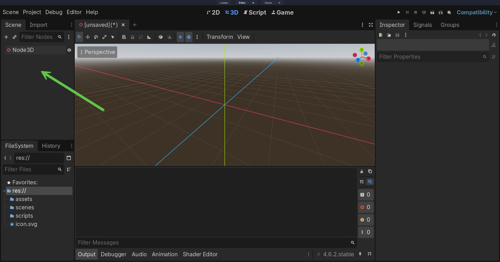

# Editor

This section is a reference manual for the Godot editor itself — not game design, not programming concepts, just "where is this button and what does it do." Every page here documents one specific, self-contained editor operation: creating a scene, assigning a resource, configuring a setting. None of it assumes you already know Godot; all of it assumes you have Godot open in front of you.

If you've never opened Godot before, this is where to start. If you already know your way around, treat this as a manual to dip back into whenever you forget one specific step — that's exactly what it's for, and it isn't meant to be read start to finish.

## What you'll learn

- How to create, save, and organize scenes and the nodes inside them
- How to move around the viewport confidently
- How to place, rotate, scale, and hierarchically organize objects
- How to create and attach scripts, and run your work to test it
- How to assign and configure resources through the Inspector
- How to configure project-wide settings like input, autoload, and export

## Recommended prerequisites

None. This section is the starting point for the rest of the site.

## Sections in this chapter

### Getting a scene on screen
- [Scenes & Nodes](scenes-and-nodes/index.md) — creating, saving, and organizing scenes and the node hierarchies inside them.
- [Viewport Navigation](viewport-navigation/index.md) — moving the camera around so you can actually see what you're building.

### Placing and scripting objects
- [Placement & Transforms](placement-and-transforms/index.md) — moving, rotating, scaling, and hierarchically organizing objects.
- [Scripting Basics](scripting-basics/index.md) — creating and attaching scripts, and running your work to test it.

### Configuring resources and the project
- [Inspector & Resources](inspector-and-resources/index.md) — assigning meshes, shapes, and materials through the Inspector.
- [Project Configuration](project-configuration/index.md) — input mapping, autoload, fonts, physics, and export settings.

## Where to go next

Once you can create a scene, place objects in it, and attach a script, you have everything this site's other sections assume you already know. [Operations](../operations/index.md) and [Programming](../programming/index.md) are language- and data-focused and don't depend on the editor at all. [Building Games](../building-games/index.md) and [Techniques](../techniques/index.md) both assume the editor skills in this section as a baseline.
