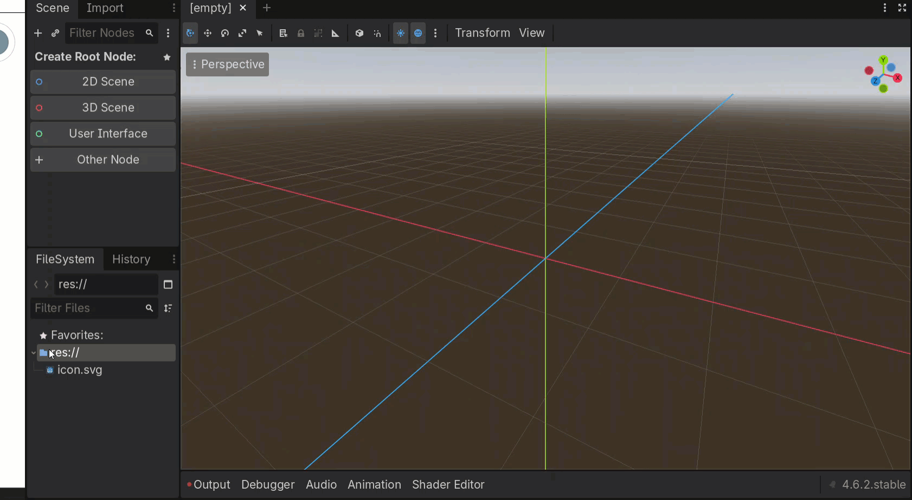
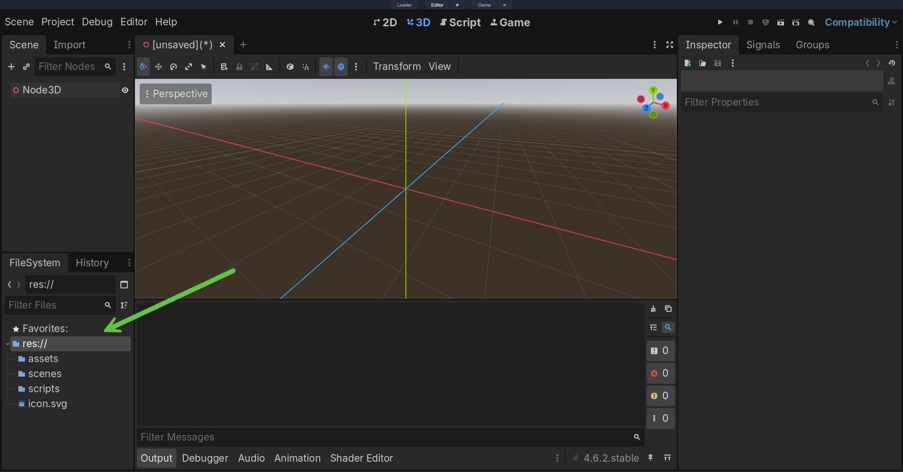

# Operation 0.3 — Create Folders in the FileSystem

## Classification

**Type:** Operation
**Category:** Project Organization
**Difficulty:** Beginner
**Estimated Time:** 1 minute

---





## Purpose

Folders in the Godot FileSystem help you organize your project files into meaningful categories.

A well-organized project is easier to:

* navigate
* debug
* share
* maintain
* expand over time

Folders are especially important in larger projects where scripts, scenes, assets, materials, audio, and textures begin to accumulate.

---

## When Would I Use This?

Use this operation whenever you need to organize your project files.

Examples:

* Store scenes in one place
* Store scripts in one place
* Store images or textures in one place
* Store sound files in one place
* Separate classroom exercises from final project assets

A useful habit is to create folders early, before the project becomes cluttered.

---

## Prerequisites

Before beginning:

* Godot is open
* A project exists

---

## Procedure

### Step 1 — Open the FileSystem Panel

Look for the **FileSystem** panel, usually located in the bottom-left area of the editor.

This panel shows the contents of the project folder.

Example:

```text
res://
```

---

### Step 2 — Choose Where the Folder Will Go

Decide what kind of files the folder will contain.

Common folder ideas:

| Folder Name | Purpose                                         |
| ----------- | ----------------------------------------------- |
| scenes      | Stores `.tscn` files                            |
| scripts     | Stores `.gd` files                              |
| assets      | Stores imported images, models, and other media |
| audio       | Stores sound effects and music                  |
| materials   | Stores materials and resource files             |
| ui          | Stores interface-related scenes and assets      |
| levels      | Stores level scenes                             |

---

### Step 3 — Create the Folder

In the FileSystem panel, right-click in the project area and choose:

```text
New Folder
```

Or use the folder creation button if visible in your version of Godot.

A new folder will appear.

---

### Step 4 — Name the Folder

Give the folder a clear, descriptive name.

Good examples:

```text
scenes
scripts
assets
audio
materials
ui
levels
```

Poor examples:

```text
stuff
misc
new folder
test
```

Choose names that make the folder’s purpose obvious at a glance.

---

### Step 5 — Confirm the Folder Exists

The folder should now appear in the FileSystem panel.

Example project structure:

```text
res://
├── scenes/
├── scripts/
├── assets/
├── audio/
```

---

## Success Check

You should now have:

✓ A new folder in the FileSystem

✓ A clear folder name

✓ A project structure that is easier to navigate

---

## Common Mistakes

### Mistake 1

Creating files before creating folders.

Result:

Important files get scattered across the root directory.

Solution:

Create a folder structure early in the project.

---

### Mistake 2

Using vague folder names.

Example:

```text
stuff/
```

Result:

The folder becomes difficult to understand later.

Solution:

Use names based on file type or function.

---

### Mistake 3

Making too many nested folders too soon.

Example:

```text
res://
├── assets/
│   ├── project1/
│   │   ├── draft/
│   │   │   ├── old/
```

Result:

The project becomes harder to navigate than necessary.

Solution:

Keep folder structures simple unless the project truly needs more complexity.

---

### Mistake 4

Mixing unrelated file types together.

Example:

```text
res://
├── scenes/
├── scripts/
├── images/
├── sounds/
├── random/
```

Result:

Files become harder to find and reuse.

Solution:

Use a consistent organizational system.

---

## Why This Matters

Folder structure is part of project design.

A clean file system helps you:

* find resources quickly
* avoid duplicate files
* understand the project at a glance
* collaborate with other people
* scale from small exercises to larger games

Good organization saves time during development and reduces confusion later.

---

## Design Insight

Think of folders as a map of your project’s logic.

A good folder structure often reflects how you think about the game itself.

For example:

```text
res://
├── scenes/
├── scripts/
├── assets/
├── audio/
├── materials/
```

This structure tells you:

* what is a scene
* what is code
* what is art
* what is sound
* what is reusable data

That kind of organization helps separate ideas before they become tangled.

---

## Professional Practice

Many developers use a folder structure like this:

```text
res://
├── scenes/
├── scripts/
├── assets/
│   ├── textures/
│   ├── models/
│   └── icons/
├── audio/
│   ├── sfx/
│   └── music/
├── materials/
├── ui/
└── levels/
```

You do not need to start with a complex structure.

You do need to start with a structure that is easy to understand.

---

## Related Operations

* 0.0 Open Godot and Create a Scene
* 0.1 Add a Child Node
* 0.2 Save a Scene
* 0.4 Rename a Node
* 0.5 Import a File

---

## Related Techniques

This operation supports the following techniques:

* Scene Organization
* Project Management
* Reusable Scene Design
* Asset Management
* Workflow Discipline